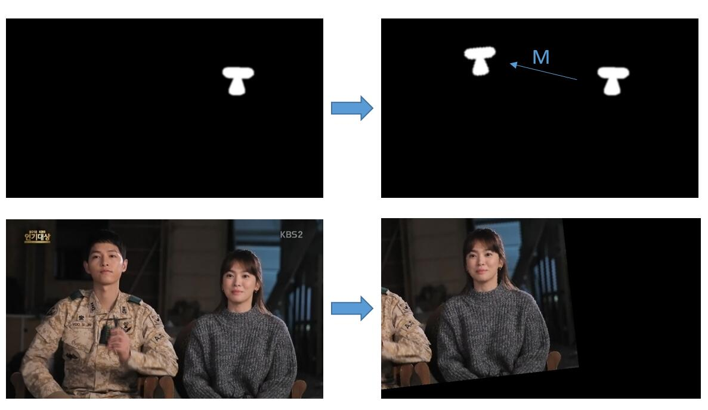
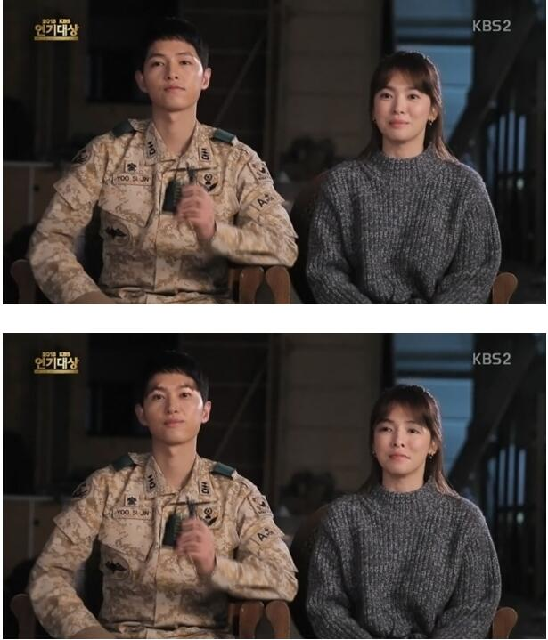

# SwitchFace -- using python with openCV and dlib to switch face in an image. 

This is the code for my [blog](http://messcode.github.io/2016/04/17/switch-faces-using-python/). If you want to know more details, you might read it.

This repository is modified from https://github.com/matthewearl/faceswap which is under MIT license.

## Transform face

## Switch face！

